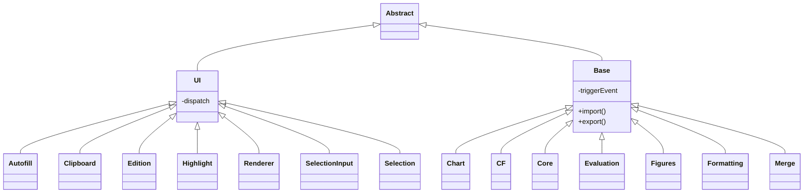
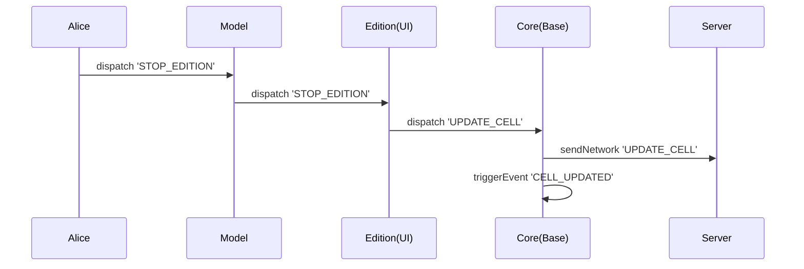

```mermaid
classDiagram
Abstract <|-- UI
Abstract <|-- Base
UI <|-- Autofill
UI <|-- Clipboard
UI <|-- Edition
UI <|-- Highlight
UI <|-- Renderer
UI <|-- SelectionInput
UI <|-- Selection
Base <|-- Chart
Base <|-- CF
Base <|-- Core
Base <|-- Evaluation
Base <|-- Figures
Base <|-- Formatting
Base <|-- Merge
class UI {
  -dispatch
}
class Base {
  -triggerEvent
  +import()
  +export()
}
```

```mermaid
sequenceDiagram
    participant Alice
    participant Model
    participant Edition(UI)
    participant Core(Base)
    participant Server
    Alice->>Model: dispatch 'STOP_EDITION'
    Model->>Edition(UI): dispatch 'STOP_EDITION'
    Edition(UI)->>Core(Base): dispatch 'UPDATE_CELL'
    Core(Base)->>Server: sendNetwork 'UPDATE_CELL'
    Core(Base)->>Core(Base): triggerEvent 'CELL_UPDATED'
```
