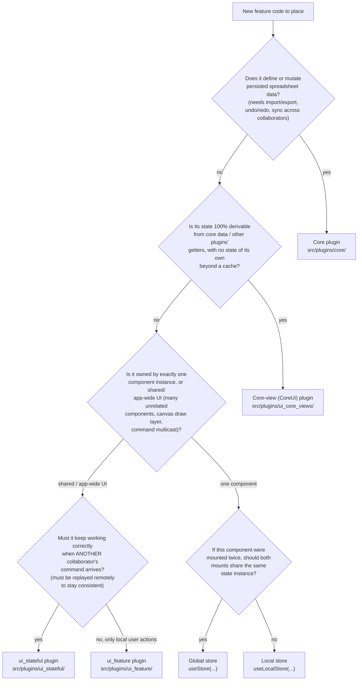
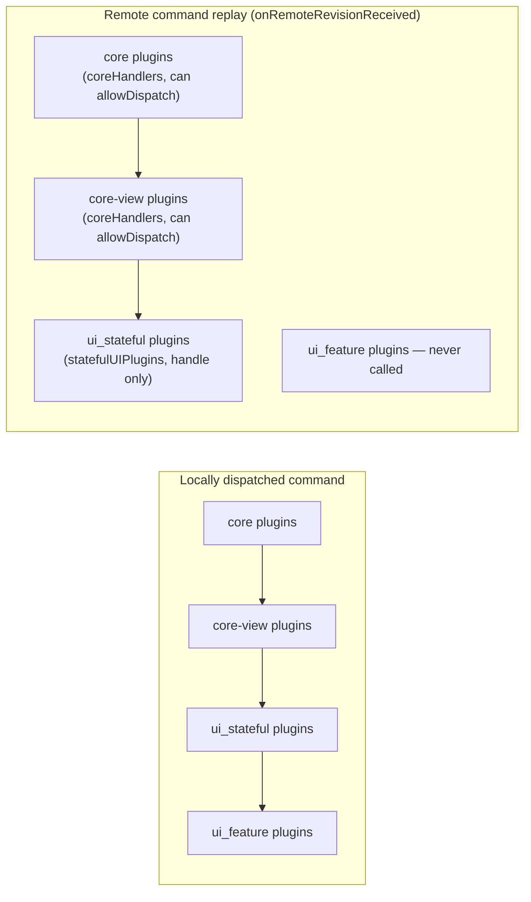
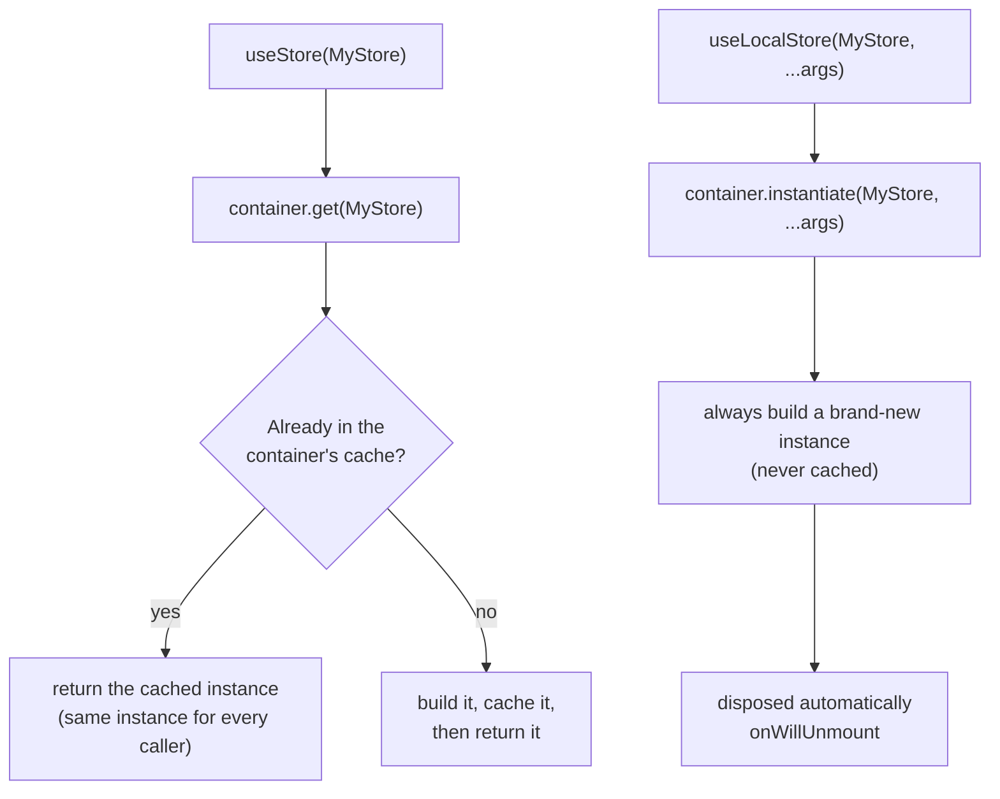

- [Where should this code live?](#where-should-this-code-live)
  - [The decision tree](#the-decision-tree)
  - [Why `ui_feature` vs `ui_stateful`: the collaborative-replay rule](#why-ui_feature-vs-ui_stateful-the-collaborative-replay-rule)
  - [Why global store vs local store: the container mechanics](#why-global-store-vs-local-store-the-container-mechanics)
  - [Capability matrix](#capability-matrix)
  - [Gotchas: where the codebase itself blurs the line](#gotchas-where-the-codebase-itself-blurs-the-line)
  - [Quick reference](#quick-reference)

# Where should this code live?

o-spreadsheet gives you six legitimate places to put a new feature's code:

1. **Core plugin** (`src/plugins/core/`)
2. **Core-view plugin**, a.k.a. "CoreUi" (`src/plugins/ui_core_views/`)
3. **`ui_feature` plugin** (`src/plugins/ui_feature/`)
4. **`ui_stateful` plugin** (`src/plugins/ui_stateful/`)
5. **Global store** (`src/stores/`, obtained with `useStore`)
6. **Local store** (co-located with a component, obtained with `useLocalStore`)

This page gives a walkable decision tree to pick one, then explains the two forks that are usually the confusing ones (`ui_feature` vs `ui_stateful`, global vs local store) with the actual mechanical rule behind them — not just the soft convention. It ends with a table of known cases where the existing codebase doesn't cleanly follow its own rule, so you don't panic when you find one.

This page assumes you already know what a plugin and a command are — see [architecture.md](./architecture.md), [plugin.md](./plugin.md) and [business_feature.md](./business_feature.md) for that. For stores, see [`src/store_engine/README.md`](../../src/store_engine/README.md), which this page complements rather than repeats.

## The decision tree



Notes on the tree:

- **Q1** is the only question about _persistence_. If the answer is yes, it's a core plugin, full stop — everything downstream (import/export, `this.history.update`, collaborative sync) is a consequence of this one answer.
- **Q2** is the "derived, not owned" test. Cell evaluation, computed styles, dynamic table ranges — none of these are their own source of truth, they're recomputed from core data (and possibly other core-view getters). Because every collaborator recomputes the same thing from the same replayed core commands, a core-view plugin's state never needs to be transmitted itself.
- **Q3** is the plugin-vs-store fork, already documented in detail in [`src/store_engine/README.md#when-to-use-a-store-and-when-to-use-a-plugin`](../../src/store_engine/README.md#when-to-use-a-store-and-when-to-use-a-plugin) — read that section for the full reasoning (rendering cost, boilerplate, multiple mounts). This tree just routes you there.
- **Q4** and **Q5** are each expanded below, because the answer isn't a matter of taste — it's enforced by actual code paths (`src/model.ts` for Q4, `src/store_engine/dependency_container.ts` for Q5).

## Why `ui_feature` vs `ui_stateful`: the collaborative-replay rule

Both categories extend the same `UIPlugin` base class — there's no compile-time difference between them. The registries even document the _intent_ in a one-line comment each (`src/plugins/plugin_registries.ts`):

```ts
// Plugins which handle a specific feature, without handling any core commands
export const featurePluginRegistry = new Registry<UIPluginConstructor>()...

// Plugins which have a state, but which should not be shared in collaborative
export const statefulUIPluginRegistry = new Registry<UIPluginConstructor>()...
```

...but the comment alone doesn't tell you _how_ to decide. The real, code-enforced distinction lives in `src/model.ts`, in how a **remote** command (replayed from another collaborator) is dispatched:



- Core and core-view plugins are in `coreHandlers`: they replay every remote command and can even `allowDispatch`/reject it.
- `ui_stateful` plugins are replayed too (via a separate `statefulUIPlugins` list, `handle()` only, no veto power) — this is what lets `GridSelectionPlugin` adjust the local selection when a remote user deletes the row it was pointing at, for example.
- `ui_feature` plugins are **never** replayed remotely. `model.ts` explicitly guards against it (`isReplayingCommand`), because a feature plugin's job is to expand one local, high-level command (e.g. `SORT_CELLS`) into a sequence of core commands — and only those resulting core commands are what actually gets sent to other collaborators. Replaying the feature plugin itself on a remote peer would be redundant (or wrong, since the _inputs_ to the expansion may no longer make sense after other changes).

So the practical test for Q4 is: **does this plugin need to react to something another user did, in order to stay correct?** If yes → `ui_stateful` (selection, clipboard, header pixel positions — things that must adjust when someone else edits the sheet out from under you). If the plugin only ever fires in response to the local user pressing a button or typing a formula, and its whole job is "turn this one action into several core commands" → `ui_feature`.

## Why global store vs local store: the container mechanics

Unlike the plugin categories, global vs local is not a property of the store's class, its file location, or its base class — it's decided purely by **which hook is called at the use site**:



(`src/store_engine/dependency_container.ts` — `get()` vs `instantiate()`; `src/store_engine/store_hooks.ts` — `useStore` vs `useLocalStore`.)

One subtlety: a store's _own_ internal dependencies (`this.get(OtherStore)` inside a store's constructor) always resolve through the shared cache, regardless of whether the store itself was obtained via `useStore` or `useLocalStore`. So a locally-instantiated store can still depend on a genuinely global one (e.g. every `SpreadsheetStore` depends on the shared `RendererStore` to register its `drawLayer`).

The practical test for Q5: **if this component were mounted twice (e.g. the same side panel opened from two places, or a component reused in a list), should the two mounts see and mutate the same state, or should each have its own independent copy?** Same state → global (`useStore`). Independent copies → local (`useLocalStore`).

## Capability matrix

|                                    | Core plugin    | Core-view plugin         | `ui_feature` plugin | `ui_stateful` plugin | Global store                                                                                                                       | Local store                                        |
| ---------------------------------- | -------------- | ------------------------ | ------------------- | -------------------- | ---------------------------------------------------------------------------------------------------------------------------------- | -------------------------------------------------- |
| Persisted (import/export)          | ✔              | ✘                        | ✘                   | ✘                    | ✘                                                                                                                                  | ✘                                                  |
| Undo/redo history (`this.history`) | ✔              | ✔ (cache only)           | ✔                   | ✔                    | ✘                                                                                                                                  | ✘                                                  |
| Replayed on remote commands        | ✔, can reject  | ✔, can reject            | ✘, never            | ✔, cannot reject     | n/a (stores don't participate in replay directly; a store built on `SpreadsheetStore` reacts to the _finalized_ local model state) | n/a                                                |
| Can dispatch commands              | ✔              | ✘                        | ✔                   | ✔                    | indirectly, via `ModelStore`/`this.model.dispatch`                                                                                 | indirectly, via `ModelStore`/`this.model.dispatch` |
| Can draw on canvas (`drawLayer`)   | ✘              | ✘                        | ✔                   | ✔                    | ✔ (if extends `SpreadsheetStore`)                                                                                                  | ✔ (if extends `SpreadsheetStore`)                  |
| Typical scope                      | whole document | whole document (derived) | whole app UI        | whole app UI         | whole app                                                                                                                          | one component (or subtree)                         |

## Gotchas: where the codebase itself blurs the line

The tree above is the _target_ rule. In practice, several existing plugins and stores don't cleanly follow it — usually because a case turned out messier once written, or because the code predates today's convention. Don't take these as a license to ignore the tree, but don't be surprised by them either:

- **Folder vs. registry mismatch.** Five of the ten `statefulUIPluginRegistry` entries physically live under `src/plugins/ui_feature/`, not `ui_stateful/`: `HeaderVisibilityUIPlugin`, `CellComputedStylePlugin`, `TableComputedStylePlugin`, `LockSheetPlugin`, `FigureUIPlugin`. File location is not a reliable signal of the actual category — the registry in `plugin_registries.ts` is the source of truth.
- **`HeaderVisibilityUIPlugin`** (`src/plugins/ui_feature/header_visibility_ui.ts`) has no state of its own — pure getters, which by Q2 looks like a core-view plugin. It's `ui_stateful` instead because it depends on `FilterEvaluationPlugin`'s getters, and `FilterEvaluationPlugin` is itself `ui_stateful` — a core-view plugin can't safely depend on non-core-view state, since it must stay re-derivable in lockstep purely from replayed core commands.
- **`CellComputedStylePlugin` / `TableComputedStylePlugin`** are, in spirit, textbook core-view plugins (100% derived from core data), but are registered `ui_stateful`.
- **`LockSheetPlugin`** is a pure `allowDispatch` guard with no state at all — arguably the purest possible `ui_feature`, yet it's registered `ui_stateful`.
- **`FigureUIPlugin`** expands local commands (`MOVE_FIGURES`, `DELETE_FIGURES`) into per-figure core commands, exactly like a `ui_feature` plugin — yet it's registered `ui_stateful`.
- Conversely, some `featurePluginRegistry` plugins hold real, persistent-for-the-session state despite the registry comment saying features don't need one: `GeoFeaturePlugin` (geo-JSON cache), `PivotPresencePlugin` (presence tracker), `HistoryPlugin` (the local undo/redo stack itself).
- **`HighlightStore`** is used as _both_ a global store (`useStore` in `grid.ts`, `named_range_selector.ts`) and a local store (`useLocalStore` in `components/helpers/highlight_hook.ts`) at the same time in the same running app. These are separate, uncoordinated instances of the same class — not one shared highlight registry — so don't assume every `HighlightStore` consumer sees the same highlights unless you check which hook it used.
- **`RendererStore`** defaults to global (most stores get it via `this.get(RendererStore)` in `SpreadsheetStore`), but is explicitly re-instantiated locally for secondary/standalone canvases (`components/dashboard/dashboard.ts`, `components/standalone_grid_canvas/standalone_grid_canvas.ts`) that need to render an independent subset of layers.
- **`ComposerFocusStore`** and **`SidePanelStore`** live under `src/components/**`, which by convention suggests "local," but are used exclusively via `useStore` — they're de facto global singletons despite the file location. As with plugins, file location isn't a reliable signal here either — check the hook used at the call site.
- **Feature-subtree-scoped stores** — `ConditionalFormattingEditorStore`, `PivotSidePanelStore`, `FindAndReplaceStore` — are instantiated once with `useLocalStore` at the root of a panel and then prop-drilled to child components, rather than re-fetched. They're neither purely global nor purely single-component-local. Nothing in the type system stops a descendant from mistakenly calling `useStore` on the same class and silently getting a second, disconnected instance — if you add a child to one of these subtrees, take the store as a prop, don't re-fetch it.
- **The boundary keeps moving.** `git log` on `plugin_registries.ts` shows an ongoing trend of migrating plugins into stores (`split_to_columns`, `automatic_sum`, the viewport/`SheetView` plugin) once their state turns out to be component-owned after all. If you're touching one of these areas, check whether it has already moved before assuming the plugin is still authoritative.

## Quick reference

| I want to...                                                                | Put it in...         | Example                                    |
| --------------------------------------------------------------------------- | -------------------- | ------------------------------------------ |
| Add a new spreadsheet-data concept (e.g. a new persisted object type)       | Core plugin          | `SheetPlugin`, `MergePlugin`               |
| Compute something purely from core data (evaluation, computed style caches) | Core-view plugin     | `EvaluationPlugin`, `HeaderSizeUIPlugin`   |
| Translate one high-level user action into several core commands             | `ui_feature` plugin  | `SortPlugin`, `InsertPivotPlugin`          |
| Keep per-user transient state consistent even under remote edits            | `ui_stateful` plugin | `GridSelectionPlugin`, `ClipboardPlugin`   |
| Share UI state/logic across many unrelated components, app-wide             | Global store         | `NotificationStore`, `ViewportsStore`      |
| Back a single component's own state/business logic (one instance per mount) | Local store          | `AutomaticSumStore`, `FindAndReplaceStore` |
