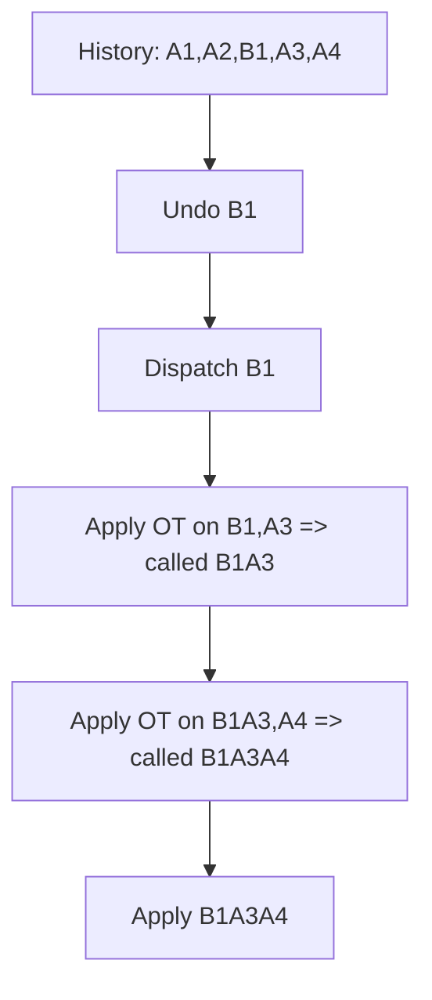

```mermaid
graph TD
  id1[History: A1,A2,B1,A3,A4] --> id2[Undo B1]
  id2 --> id3[Dispatch B1]
  id3 --> id4[Apply OT on B1,A3 => called B1A3]
  id4 --> id5[Apply OT on B1A3,A4 => called B1A3A4]
  id5 --> id6[Apply B1A3A4]

```

OT<A in CommandType, B in CommandType>(a : A, b : B): a' : A | undefined
