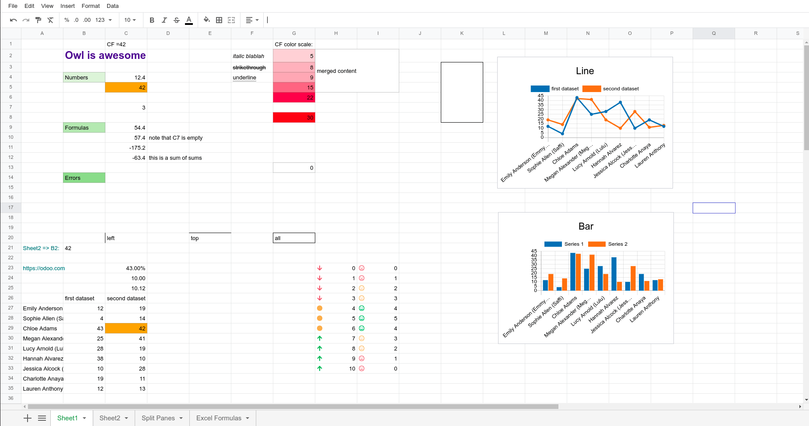

# o-spreadsheet

[](https://www.npmjs.com/package/@odoo/o-spreadsheet)

A standalone spreadsheet for the web, easily integrable and extendable.

a.k.a. "[Owly](https://github.com/odoo/owl) Sheet" 🦉

- All basic features you can expect from a spreadsheet
- Real time collaboration
- Import/Export of excel file format
- and more...

**Try it online** with the [live demo](https://odoo.github.io/o-spreadsheet/)!



## Integrating o-spreadsheet

1. [Getting started](doc/integrating/integration.md#getting-started)
2. [Spreadsheet component props](doc/integrating/integration.md#spreadsheet-component-props)
3. [Model creation](doc/integrating/integration.md#model-creation)
4. [Collaborative edition](doc/integrating/integration.md#collaborative-edition)
5. [Translation](doc/integrating/integration.md#translation)
<!--

- use with other UI library
- use with Typescript
  -->

## Extending the functionalities of o-spreadsheet

1. [Architecture](doc/extending/architecture.md)
2. [Custom function](doc/add_function.md)
3. [Connecting to an external API](doc/add_function.md#connecting-to-an-external-api)
4. [Business feature](doc/extending/business_feature.md)
5. Menu items (under construction)
6. Side panel (under construction)
7. Notification (under construction)
8. Export Excel (under construction)
9. [Terminology](doc/o-spreadsheet_terminology.png)
10. [Translations](doc/extending/translations.md)
11. [API](doc/tsdoc/README.md)

## Run it!

```bash
# install dependencies
npm install

# build o_spreadsheet.js in dist/
npm run build

# build stuff, start a live server, start a collaborative server, build with --watch
npm run dev

# run the test suite
npm run test
npm run test -- --watch

# build documentation
npm run doc
```

## Contributing

- Open a pull request or an issue on this repository.
- Make sure you have [signed the CLA](https://github.com/odoo/odoo/blob/16.0/doc/cla/sign-cla.md) on [odoo repository](https://github.com/odoo/odoo).

Most of [odoo contribution guidelines](https://github.com/odoo/odoo/wiki/Contributing#making-pull-requests) apply here.
